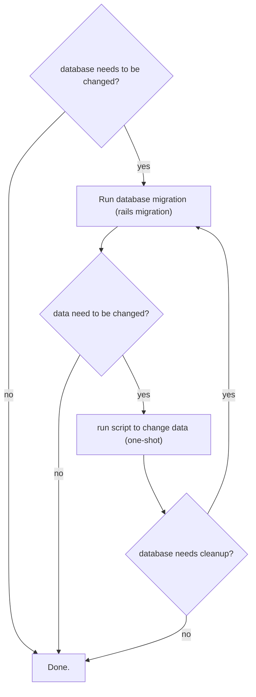

{description}

##### On This Page

# ✅ Headings

# h1 Heading 8-)
## h2 Heading
### h3 Heading
#### h4 Heading
##### h5 Heading
###### h6 Heading

```markdown
# h1 Heading 8-)
## h2 Heading
### h3 Heading
#### h4 Heading
##### h5 Heading
###### h6 Heading
```

# ✅ Table of Contents

You can add a table of contents to each page by adding a header with the following names:

* TOC
* Table of Contents
* Contents
* On This Page

Only the first one will become the header for the page.

# ✅ Horizontal Rules

___

---

***

```markdown
___

---

***
```

# ✅ Typographic replacements


(c) (C) (r) (R) (tm) (TM) (p) (P) +-

test.. test... test..... test?..... test!....

!!!!!! ???? ,,  -- ---

"Smartypants, double quotes" and 'single quotes'

```markdown
Enable typographer option to see result.

(c) (C) (r) (R) (tm) (TM) (p) (P) +-

test.. test... test..... test?..... test!....

!!!!!! ???? ,,  -- ---

"Smartypants, double quotes" and 'single quotes'
```
# ✅ Emphasis

**This is bold text**

__This is bold text__

*This is italic text*

_This is italic text_

~~Strikethrough~~

```markdown
**This is bold text**

__This is bold text__

*This is italic text*

_This is italic text_

~~Strikethrough~~

```


# ✅ Blockquotes

> Blockquotes can also be nested...
>> ...by using additional greater-than signs right next to each other...
> > > ...or with spaces between arrows.

```markdown
> Blockquotes can also be nested...
>> ...by using additional greater-than signs right next to each other...
> > > ...or with spaces between arrows.
```


# ✅ Lists

## ✅ Unordered

+ Create a list by starting a line with `+`, `-`, or `*`
+ Sub-lists are made by indenting 2 spaces:
  - Marker character change forces new list start:
    * Ac tristique libero volutpat at
    + Facilisis in pretium nisl aliquet
    - Nulla volutpat aliquam velit
+ Very easy!

```markdown
+ Create a list by starting a line with `+`, `-`, or `*`
+ Sub-lists are made by indenting 2 spaces:
  - Marker character change forces new list start:
    * Ac tristique libero volutpat at
    + Facilisis in pretium nisl aliquet
    - Nulla volutpat aliquam velit
+ Very easy!
```

## ✅ Ordered

1. Lorem ipsum dolor sit amet
2. Consectetur adipiscing elit
3. Integer molestie lorem at massa


1. You can use sequential numbers...
1. ...or keep all the numbers as `1.`

Start numbering with offset:

57. foo
1. bar

```markdown
1. Lorem ipsum dolor sit amet
2. Consectetur adipiscing elit
3. Integer molestie lorem at massa


1. You can use sequential numbers...
1. ...or keep all the numbers as `1.`

Start numbering with offset:

57. foo
1. bar
```

# :last_quarter_moon: Code

Inline `code` ✅

Indented code ❌ [doesn't work. use fenced code blocks]

    // Some comments
    line 1 of code
    line 2 of code
    line 3 of code


Block code "fences" ✅

```
Sample text here...
```

Syntax highlighting ✅

``` js
var foo = function (bar) {
  return bar++;
};

console.log(foo(5));
```

```markdown
Inline `code`

Indented code

    // Some comments
    line 1 of code
    line 2 of code
    line 3 of code


Block code "fences"

\```
Sample text here...
\```

Syntax highlighting

\``` js
var foo = function (bar) {
  return bar++;
};

console.log(foo(5));
\```

```

# ✅ Tables

| Option | Description |
| ------ | ----------- |
| data   | path to data files to supply the data that will be passed into templates. |
| engine | engine to be used for processing templates. Handlebars is the default. |
| ext    | extension to be used for dest files. |

Right aligned columns

| Option | Description |
| ------:| -----------:|
| data   | path to data files to supply the data that will be passed into templates. |
| engine | engine to be used for processing templates. Handlebars is the default. |
| ext    | extension to be used for dest files. |

```markdown
| Option | Description |
| ------ | ----------- |
| data   | path to data files to supply the data that will be passed into templates. |
| engine | engine to be used for processing templates. Handlebars is the default. |
| ext    | extension to be used for dest files. |

Right aligned columns

| Option | Description |
| ------:| -----------:|
| data   | path to data files to supply the data that will be passed into templates. |
| engine | engine to be used for processing templates. Handlebars is the default. |
| ext    | extension to be used for dest files. |
```
# ✅ Links

[link text](http://dev.nodeca.com)

[link with title](http://nodeca.github.io/pica/demo/ "title text!")

Autoconverted link https://github.com/nodeca/pica

```markdown
[link text](http://dev.nodeca.com)

[link with title](http://nodeca.github.io/pica/demo/ "title text!")

Autoconverted link https://github.com/nodeca/pica
```
# 🌗 Images [needs reference/footnote support]


Like links, Images also have a footnote style syntax

![Alt text][id]

With a reference later in the document defining the URL location:

[id]: https://octodex.github.com/images/dojocat.jpg  "The Dojocat"

```markdown


Like links, Images also have a footnote style syntax

![Alt text][id]

With a reference later in the document defining the URL location:

[id]: https://octodex.github.com/images/dojocat.jpg  "The Dojocat"
```
# Plugins

The killer feature of `markdown-it` is very effective support of
[syntax plugins](https://www.npmjs.org/browse/keyword/markdown-it-plugin).


## ✅ [Emojies](https://github.com/markdown-it/markdown-it-emoji)

> Classic markup: :wink: :crush: :cry: :tear: :laughing: :yum:
>
> Shortcuts (emoticons): :-) :-( 8-) ;)


```markdown
> Classic markup: :wink: :crush: :cry: :tear: :laughing: :yum:
>
> Shortcuts (emoticons): :-) :-( 8-) ;)
```

## ✅ [Subscript](https://github.com/markdown-it/markdown-it-sub) / [Superscript](https://github.com/markdown-it/markdown-it-sup)

- 19^th^
- H~2~O


## ✅ [_ins_](https://github.com/markdown-it/markdown-it-ins)

++Inserted text++


## ✅ [_mark_](https://github.com/markdown-it/markdown-it-mark)

==Marked text==

## ✅ Autolinks

Automatically generate links.


www.example.com, https://example.com, and contact@example.com

```markdown
www.example.com, https://example.com, and contact@example.com
```

## ✅ Task Lists

* [ ] Task 1
* [x] Task 2
  * [X] Subtask 2.1

```markdown
* [ ] Task 1
* [x] Task 2
  * [X] Subtask 2.1
```

## 🌗 Checkboxes [indeterminate not working]

Here is a checkbox: :::check:::

:::check disabled::: Not Done

:::check disabled checked::: Done 

:::check disabled indeterminate::: Done partially done

:::check::: Not Done

:::check checked::: Done 

:::check indeterminate::: Done partially done

```markdown
:::check disabled::: Not Done

:::check disabled checked::: Done 

:::check disabled indeterminate::: Done partially done

:::check::: Not Done

:::check checked::: Done 

:::check indeterminate::: Done partially done
```

## ❌ [Footnotes](https://github.com/markdown-it/markdown-it-footnote)

Footnote 1 link[^first].

Footnote 2 link[^second].

Inline footnote^[Text of inline footnote] definition.

Duplicated footnote reference[^second].

[^first]: Footnote **can have markup**

    and multiple paragraphs.

[^second]: Footnote text.


## ❌ [Definition lists](https://github.com/markdown-it/markdown-it-deflist)

Term 1
:   Definition 1 with lazy continuation.

Term 2 with *inline markup*
:   Definition 2

    <!-- &#123; some code, part of Definition 2 &#125; -->

    Third paragraph of definition 2.

_Compact style:_

Term 1
  ~ Definition 1

Term 2
  ~ Definition 2a
  ~ Definition 2b


## ❌ [Abbreviations](https://github.com/markdown-it/markdown-it-abbr)

This is HTML abbreviation example.

It converts "HTML", but keep intact partial entries like "xxxHTMLyyy" and so on.

*[HTML]: Hyper Text Markup Language

## ❌ [Custom containers](https://github.com/markdown-it/markdown-it-container)

::: warning
*here be dragons*
:::

## ✅ Emoji Support

Github-style emojis are supported via [node-emoji](https://github.com/omnidan/node-emoji). [List of emojis](https://www.webfx.com/tools/emoji-cheat-sheet/).
Emoticons are supported via [emoticons](https://github.com/wooorm/emoticon/blob/HEAD/support.md).

## ✅ Latex Support
You can write html, that contains expressions like this:  $x ^ 2 + 5$ inside them. As you probably know. You also can write expressions in display mode as follows: 
$$ 
\sum_{i=1}^n(x_i^2 - \overline{x}^2)
$$
In first case you will need to use \$expression\$ and in the second one \$\$expression\$\$. To escape the \$ symbol it's mandatory to write as follows: \\$. To use `display` mode, the block 
MUST begin with \$\$ and end with \$\$.

```markdown
You can write html, that contains expressions like this: 
$x ^ 2 + 5$ inside them. As you probably know. You also can write 
expressions in display mode as follows: 
$$
\sum_{i=1}^n(x_i^2 - \overline{x}^2)
$$
In first case you will need to use \$expression\$ and in the 
second one \$\$expression\$\$. To escape the \$ symbol it's
mandatory to write as follows: \\$. To use `display` mode, the block 
MUST begin with \$\$ and end with \$\$.

```

## 🌗 Embedding

This is a tweet:

https://twitter.com/raae/status/1045394833001652225

This is a vimeo video:

https://vimeo.com/42672205

This is an instagram post:

https://www.instagram.com/p/Bof9WhgBmY2/

This is a youtube video:

https://www.youtube.com/watch?v=aoLhACqJCUg

This is a photo from flickr:

https://www.flickr.com/photos/pedrocaetano/27432477888

This another photo, from 23hq:

http://www.23hq.com/mprove/photo/66422006

Check it out 👆

# ❌ Flowcharts (with mermaid.js)




```markdown
\```mermaid
%% Waiting for the following chart to load...
graph TB;
  db?{database needs to be changed?}
  done[Done.]
  db["Run database migration (rails migration)"]
  data?{data need to be changed?}
  data["run script to change data (one-shot)"]
  db_cleanup?{database needs cleanup?}
  db? -- yes --> db
  db? -- no  --> done
  db  --> data?
  data? -- no -->done
  data? -- yes --> data
  data --> db_cleanup?
  db_cleanup? -- yes --> db
  db_cleanup? -- no --> done
\```
```

# ❌ Return to Top with Optional Sound

Adding a button to return to the top of the page. Optionally plays a sound. The `nosound` attribute
is ideally set via a switch somewhere on the page.

[Not started yet!]

```markdown
<ToTop sound="/music/goingup.mp3" nosound/>
```

# ❌ Right Panel

## ❌ Tag Cloud
Add a tag cloud component, mainly for the right column. Sort by most popular first. Use slot props so we 
have can use slots to render it.

[Not started yet!]


```markdown
<TagCloud let:tags={tags}>
  {#each tags as tag}
    <a class="bg-secondary text-onSecondaryBg px-2" href="/tags/{tag}">{tag}</a>
  {/each}
</TagCloud>
```

# ❌ Mobile-first Page Navigation in the Left column
