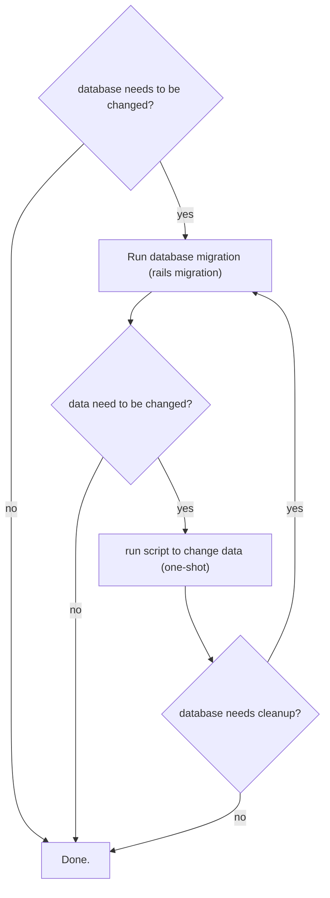

## A Little Background

The university from which I graduated did not teach any programming patterns, so when I entered the job market, I was not 
sure what _programming patterns_ (a.k.a. "*design patterns*") even were. My first job was definitely a learning experience, 
but since I was on a small team with other newbies, I didn't have many opportunities to grow well as a developer. So when 
I got my second job, with developers of all walks and experiences, I was thrown into many, many discussions about what 
pattern to apply to what idea. It was a little confusing at first, but very exhilarating! Here was the chance to lose 
some old, bad habits, and replace them with new _Patterns_! This post is about some patterns I really really like. 
I will add references and information about each pattern so you can learn as much about them them as you want!

## Migrations Are Only For Modifying The Database

This is a difficult rule to follow for lots of Rails developers, experienced and not so. Since migrations are usually 
automated, it is easy to get in the mindset of adding data changes to migrations. This violates the 
**Single Responsibility Principle**, which states, _A class should have a responsibility over a single feature of your application_.

<blog-note>
<div class="note">

Scenario: You have a nice chat app and you want to add the ability for users to 'favorite' certain messages. 
At first, you have a boolean field in your database, so your original migration looks like this:

```ruby
class CreateMessageFavorites < ActiveRecord::Migration
  def self.up
    create_table :message_favorites do |t|
      t.references :message
      t.references :user
      t.boolean    :favorite
      t.timestamps  null: false
    end
  end

  def self.down
    drop_table :message_favorites
  end
end
```

After a few months, and many _many_ messages (6 million!), you decide you want the 'favorite' button to handle 
a few more emotions, such as "makes me happy," "makes me sad," "makes me angry," "makes me crazy," and "meh, 
just a note."

</div>
</blog-note>

There are several ways of going about doing this. Once you analyze your requirements, you decide to use the 
existing `MessageFavorite#favorite` field to store the new information.Your immediate thought is to use a 
migration as such:

```ruby
class UpdateMessageFavoritesToHandleMoreEmotions < ActiveRecord::Migration
  def change
    add_column :message_favorites, :favorite_int, :int

    MessageFavorite.all.each do |mf|
      mf.update_attributes(favorite_int: MessageFavorite::EMOTIONS[mf.favorite ? 1 : 0])
    end

    remove_column :message_favorites, :favorite
    rename_column :message_favorites, :favorite_int, :favorite
  end
end
```

There are a few problems with this approach, chiefly, running a data migration in the middle of a Rails 
migration like this is going to grind things to a halt. Your deploy is going to take forever! There is also an 
issue of what happens when there is an error in your data migration which will prevent everything from happening 
and could leave you with dangling data that another migration won't be able to fix.

Change in environment is also a big issue. You may have this thoroughly tested while in development or in testing 
environments, but production is known to throw a wrench into the works. This untested environment means you need 
to baby-sit your data migration, which you won't be able to do while it's in a deploy migration. You will need 
to run this separately, in a production console.

Finally, there is the obvious issue of violations to the **SRP**. This migration does three things:

1. creates a new temporary column
2. creates the new data based on the existing data
3. replaces the original column with the new column

The best way to address all these issues is to just break the migration up into its distinct pieces, by doing the following:

1. create and run a migration to create a new column in the Db
2. run the data migration (in the production console)
3. create and run a migration to replace the old column with the new one

For many of us, step 2 is a very daunting task. Rails consoles in production are a hairy endeavor and can lead to bad 
data integrity and other sorts of bad things, including deleting all data! Fortunately for you guys, Rails already 
has a solution for this.

### Introducing Rails Runner

Rails runner is a great tool for running data migrations and other one-shot data changes in your Rails application. Rails 
runner runs a given file in the context of your Rails app. You can execute Rails runner as `rails runner bin/file.rb` or 
`rails r bin/file.rb`. While this won't solve data integrity issues, it will allow you to run a script in the current 
Rails context. This means you can have tested and peer reviewed data migrations! Amazing!

For ease of organization, you can put all your data migrations in `db/migrate/data/`. Another common place is 
`bin/one-shot/:year/:month/`. If this is a hotfix for a tech support ticket, it is helpful to put the ticket number 
in the name of the file, for instance `bin/one-shot/2016/09/TS-432098-update-bad-data.rb`. The point is, your team 
should agree on a place to put all these tickets so everyone can keep track of the changes. Developers can add a 
`post_checkout` git hook to automatically run all new scripts in the agreed-upon directory.

### Flow for Data Migrations




<div class="mermaid">
</div>

If you want to run any migration in Rails, just follow these easy steps:

  1. For data migrations, create a one-shot and use `rails runner`. This is a best practice because it allows your 
  team to test and review your changes. **NEVER EVER EVER RUN A PRODUCTION CONSOLE!**

  2. Use `rails migrations` **FOR DATABASE MODEL CHANGES ONLY**
  3. Apply rules _1_ and _2_ as liberally as possible.

If you want to create a data migration, use one-shots. If you want to create a data migration with a database 
change, separate the two concerns into a Rails migration, then a data migration, then a cleanup migration if 
needed. Of course, YMMV, as with any best practice, just make sure your team is onboard with it and, above all, 
remember that agreeing on standard practices is the core of a happy team!

<!--
## Presenting Presenters
[About Presenters, decorator pattern]

## Interacting With Objects
[about interactors, service object patters]

## Keeping Controllers Under Control
[about controllers as parameter fetchers for other objects that actuall do the work]

## ActiveRecord Is For Recording
[AR models should be only datastore - allows for switching DBs out - SQL should all be here - when switching Dbs, you only need to edit the models]

## Views: A New View
[use jbuilder/jb, separate views for each format, instead of `render :json...`]

## Proper Tooling
[Use tools! Use gems! Research which ones work for you and your team. Do not reinvent the wheel!]
-->
